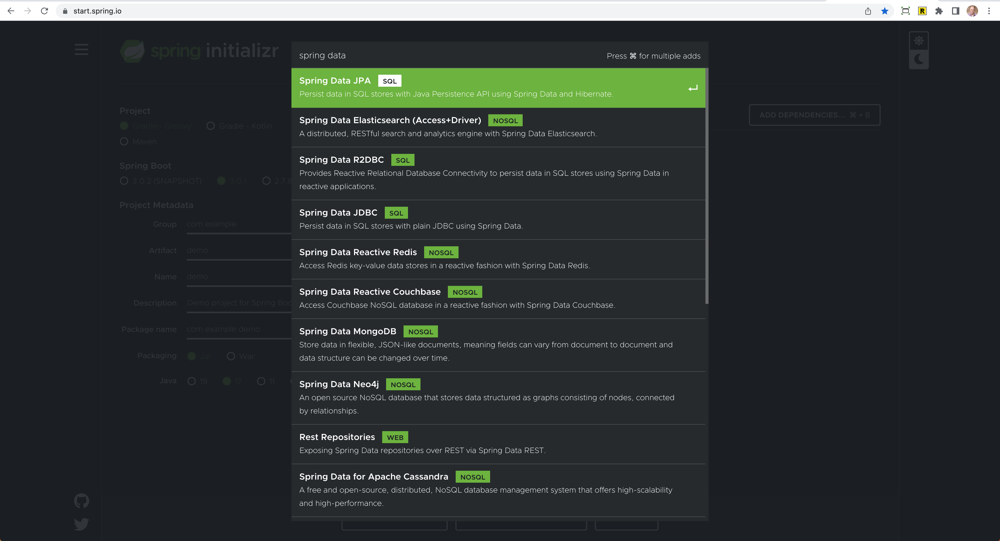

# Data 

At the heart of any application is the data that drives it. Traditionally Java has made connecting to a datasource, 
reading and persisting data verbose and complex. Spring Boot and Spring data takes this process and 
simplifies each step so that you can focus on building applications. 

Spring Boot integrates with a number of data technologies, both SQL and NoSQL.

## SQL Databases

I want to kick off the discussion by taking a trip down memory lane. We are going to take a look at an example
application to see how we can use JDBC (Java DataBase Connectivity) to connect to a database in Java and execute queries.

https://github.com/CodeMash-2023-Spring-Workshop/hello-jdbc

## Spring JDBC API

Spring provides a starter that gives us a database Connectivity API that defines how a client may connect and query 
a database. To get started head over to start.spring.io and select `JDBC API` from the dependency's dropdown. 

Starter for using JDBC with the HikariCP connection pool: 

```xml
<dependencies>
    <dependency>
        <groupId>org.springframework.boot</groupId>
        <artifactId>spring-boot-starter-jdbc</artifactId>
    </dependency>
</dependencies>
```

This isn't Spring Data - We will cover that later

org.springframework.jdbc.core; view docs -> https://docs.spring.io/spring-framework/docs/current/javadoc-api/org/springframework/jdbc/core/package-summary.html
Provides the core JDBC framework, based on JdbcTemplate and its associated callback interfaces and helper objects. 
JDBC Template - It simplifies the use of JDBC and helps to avoid common errors.
https://docs.spring.io/spring-framework/docs/current/javadoc-api/org/springframework/jdbc/core/JdbcTemplate.html

- create a new branch on the runnerz app (spring-jdbc-start)
- add spring-boot-starter-jdbc
- add h2 database dependency

## Configuring a Datasource 

Java’s `javax.sql.DataSource` interface provides a standard method of working with database connections. Traditionally, a 'DataSource' uses a URL along with some credentials to establish a database connection.

It is often convenient to develop applications by using an in-memory embedded database. Obviously, in-memory databases do not provide persistent storage. You need to populate your database when your application starts and be prepared to throw away data when your application ends.

In-Memory is great for rapid prototyping / testing (traditionally) 

- H2 In-Memory DB
- PostgreSQL
- Logging / Debugging

## JDBC Template

Spring’s JdbcTemplate and NamedParameterJdbcTemplate classes are auto-configured, and you can @Autowire them directly into your own beans, as shown in the following example:

```java
@Service
public class RunService {

    private final JdbcTemplate jdbcTemplate;

    // remember that @Autowired is implicit
    public RunService(JdbcTemplate jdbcTemplate) {
        this.jdbcTemplate = jdbcTemplate;
    }

}
```

https://docs.spring.io/spring-framework/docs/current/javadoc-api/org/springframework/jdbc/core/JdbcTemplate.html

```java
@Service
public class RunService {

    private static final Logger log = LoggerFactory.getLogger(RunService.class);
    private final JdbcTemplate jdbcTemplate;

    public RunService(JdbcTemplate jdbcTemplate) {
        this.jdbcTemplate = jdbcTemplate;
    }

    RowMapper<Run> rowMapper = (rs, rowNum) -> new Run(rs.getInt("id"),
            rs.getString("title"),
            rs.getObject("started_on",LocalDateTime.class),
            rs.getObject("completed_on",LocalDateTime.class),
            rs.getInt("miles"),
            Location.valueOf(rs.getString("location")));

    public List<Run> findAll() {
        String sql = "SELECT id,title,started_on,completed_on,miles,location from Run";
        return jdbcTemplate.query(sql,rowMapper);
    }

    public Run findById(Integer id) {
        String sql = "SELECT id,title,started_on,completed_on,miles,location from Run where id = ?";
        return jdbcTemplate.queryForObject(sql,rowMapper,id);
    }

    public void create(Run run) {
        String sql = "INSERT INTO Run(title,started_on,completed_on,miles,location) VALUES(?,?,?,?,?)";
        int rows = jdbcTemplate.update(sql, run.title(), run.startedOn(), run.completedOn(), run.miles(), String.valueOf(run.location()));
        if(rows == 1) {
            log.info("Run was created successfully!");
        }
    }

    public void update(Run run, int id) {
        String sql = """
                UPDATE RUN
                SET title = ?,
                    started_on = ?,
                    completed_on = ?,
                    miles = ?,
                    location = ?
                WHERE id = ?
                """;
        int rows = jdbcTemplate.update(sql, run.title(), run.startedOn(), run.completedOn(), run.miles(), String.valueOf(run.location()), id);
        if(rows == 1) {
            log.info("Run was updated successfully!");
        }
    }

    public void delete(int id) {
        String sql = "DELETE from Run where id = ?";
        int rows = jdbcTemplate.update(sql, id);
        if(rows == 1) {
            log.info("Run was deleted successfully!");
        }
    }

}
```

## Spring Data

Spring Data’s mission is to provide a familiar and consistent, Spring-based programming model for data access while still retaining the special traits of the underlying data store.

**Features**
  - Powerful repository and custom object-mapping abstractions
  - Dynamic query derivation from repository method names
  - Implementation domain base classes providing basic properties
  - Support for transparent auditing (created, last changed)
  - Possibility to integrate custom repository code e

**SQL / NoSQL Support**
- SQL
  - MySql, PostgreSQL, Oracle, MsSQL, etc...
- NoSQL
  - Redis, MongoDB, Apache Cassandra, etc...

### Spring Data Modules

- Main Modules
  - Spring Data Commons - Core Spring concepts underpinning every Spring Data module.
  - **Spring Data JDBC** - Spring Data repository support for JDBC.
  - **Spring Data JPA** - Spring Data repository support for JPA.
  - Spring Data MongoDB - Spring based, object-document support and repositories for MongoDB.
  - Spring Data Redis - Easy configuration and access to Redis from Spring applications.
  - Spring Data REST - Exports Spring Data repositories as hypermedia-driven RESTful resources.
  - Spring Data for Apache Cassandra - Easy configuration and access to Apache Cassandra or large scale, highly available, data oriented Spring applications.
  - More ...  
- Community Modules
  - Spring Data Couchbase - Spring Data module for Couchbase.
  - Spring Data Azure Cosmos DB - Spring Data module for Microsoft Azure Cosmos DB.
  - Spring Data DynamoDB - Spring Data module for DynamoDB.
  - Spring Data Elasticsearch - Spring Data module for Elasticsearch.
  - Spring Data Hazelcast - Provides Spring Data repository support for Hazelcast.
  - Spring Data YugabyteDB - Spring Data module for YugabyteDB distributed SQL database.
  - More...

https://spring.io/projects/spring-data
 
### Spring Boot Starters

If you want to get an idea of starter support head over to start.spring.io -> Dependencies and type in "Spring Data"



## Spring Data JDBC

Spring Data JDBC, part of the larger Spring Data family, makes it easy to implement JDBC based repositories. This module deals with enhanced support for JDBC based data access layers. It makes it easier to build Spring powered applications that use data access technologies.

Spring Data JDBC aims at being conceptually easy. In order to achieve this it does NOT offer caching, lazy loading, write behind or many other features of JPA. This makes Spring Data JDBC a simple, limited, opinionated ORM.

### Dependencies 

- start.spring.io
  - If you were creating a new project from scratch
- Existing Project
  - Spring Data JDBC
  - Database (H2)
- Start with the previous code that used the `spring-boot-starter-jdbc`
  - This is different from `spring-boot-starter-data-jdbc`
  - this still includes h2 database

```xml
  <dependency>
      <groupId>org.springframework.boot</groupId>
      <artifactId>spring-boot-starter-data-jdbc</artifactId>
  </dependency>
  <dependency>
      <groupId>com.h2database</groupId>
      <artifactId>h2</artifactId>
      <scope>runtime</scope>
  </dependency>
```

```properties
spring.datasource.name=runnerz
spring.datasource.generate-unique-name=false
spring.h2.console.enabled=true
```

### Model

- Model
  - ID
    - @Id
    - Generation
  - Custom table names
  - Custom column names

### Repositories


How many times have you been asked on a project...
- Write a query to do x,y and z and sort it by A & B

The repository proxy has two ways to derive a store-specific query from the method name:
- By deriving the query from the method name directly.
- By using a manually defined query.


https://docs.spring.io/spring-data/commons/docs/current/reference/html/#repositories.query-methods.query-creation
https://docs.spring.io/spring-data/commons/docs/current/reference/html/#appendix.query.method.subject

- CRUD & ListCrudRepository
- Repository
- PagingAndSorting & ListPagingAndSorting
- Query derivation (FindBy)
  - findAllByTitleStartsWith
  - findRunsByLocation
  - findAllByMilesIsAndLocationIndoor
  - findAllByStartedOnAfterAndMilesGreaterThan
  - findAllByStartedOnAfterAndMilesGreaterThanEqual
  - findFirstByLocationOrderByMilesDesc
- `@Query` manually defining a query
  - listRunsWhereMilesEquals
  - Java Text Blocks


Query By Example
QueryDSL

### DDL / CommandLineRunner

### PostgreSQL 

PostgreSQL example
using docker?

### Testing


